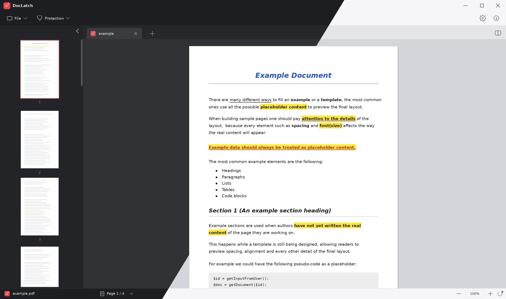

# DocLatch

DocLatch is a lightweight open-source desktop PDF viewer for Windows and Linux. Open several documents in tabs, compare them side by side in split view, and protect your files with AES-256 password encryption. Everything runs entirely on your own computer, with **no internet connection required** and **no telemetry of any kind**.



## Key features

- **Multi-document tabs**: open several PDFs at once in separate tabs, each keeping its own current page, zoom level and password.
- **Split view**: show two open documents side by side in the same window to compare them without switching tabs.
- **AES-256 password protection**: add or remove encryption from your documents in a couple of clicks, from the Protection menu. The original file is never modified.
- **Smooth zoom and scrolling**: navigate pages with smooth zooming: a loading indicator appears while the view is recalculated, never a blurry or clipped page.
- **Recent documents**: quickly find recently opened files from the home screen.
- **Fully offline**: no internet connection is needed for any feature. Nothing is ever uploaded to a server.
- **Light and dark theme**: switch between themes at any time from the settings.
- **Text size**: choose between three interface text sizes (small, medium, large) from the settings.
- **Multilingual**: interface available in Italian, English, French and German.

## Privacy

**DocLatch collects no data, sends no telemetry and requires no internet connection, ever.**

Opening, browsing, zooming and password-protecting documents all happen entirely on your own machine. There is no analytics, no crash reporting, no usage tracking and no cloud sync.

## Installation

Download the installer for your platform from the [Releases](https://github.com/ValerioGc/doc-latch/releases) section:

| Platform | File |
|----------|------|
| Windows | `DocLatch_x.x.x_windows_x64.exe` |
| Linux | `DocLatch_x.x.x_linux_x64_portable.AppImage` |

> **Windows SmartScreen notice:** the installer is not yet signed with a paid certificate, so SmartScreen may show a warning on first launch. Choose "More info" → "Run anyway" to proceed.

### Linux - AppImage

The Linux release is a self-contained portable binary that runs on any distribution without installation:

```bash
chmod +x DocLatch_x.x.x_linux_x64_portable.AppImage
./DocLatch_x.x.x_linux_x64_portable.AppImage
```

## Current limitations

- Handles **PDF** files only (no exporting to other formats yet).
- It's a viewer: it doesn't yet support editing page content (text/images) or reordering pages.
- macOS is not yet supported.

## Coming up

Planned future work includes page management and reordering, document conversion to other formats, document signing (image/text overlay), filling existing form fields (AcroForm).

## Contributing or building from source

All technical information (stack, project structure, development commands, testing and the release process) is in [DEVELOPMENT.md](DEVELOPMENT.md).
